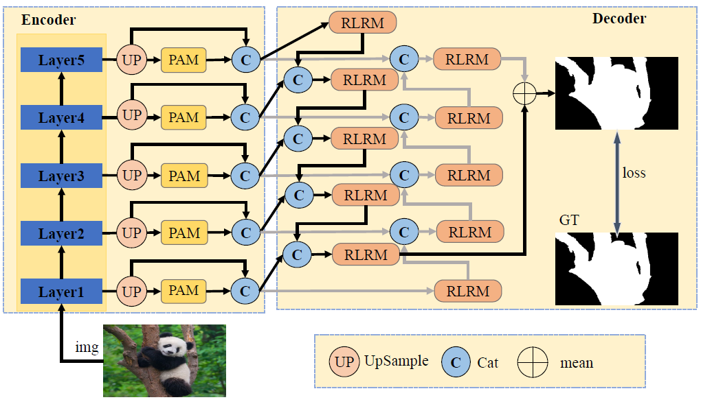

# Defocus Blur Detection

This work was co-authored by [Zonghe Shao](https://github.com/zhshao17), [Qichao Wang](https://github.com/solomonWQC), [YuZhe Cao](https://github.com/yuzheCao423), Yijin Gong, Zhuodong Luo, advised by Prof. [Hao Lu](https://sites.google.com/site/poppinace/).

## **Method**

A method for **Defocus Blur Detection** that returns to the image itself is designed based on codec architecture, where the encoder consists of ResNet18 as a feature extractor and the encoding is done by Patch Attention Module; a bidirectional recurrent RLRM as a decoder.

    

## **Datasets**

[DUT-DBD dataset](http://ice.dlut.edu.cn/ZhaoWenda/BTBCRLNet.html): Defocus Blur Detection via Multi-Stream Bottom-Top-Bottom Network

[CUHK dataset](https://www.cse.cuhk.edu.hk/~leojia/projects/dblurdetect/dataset.html): Discriminative Blur Detection Features

## Result

Comparison with existing work.

Challenges in some extreme scenarios.

